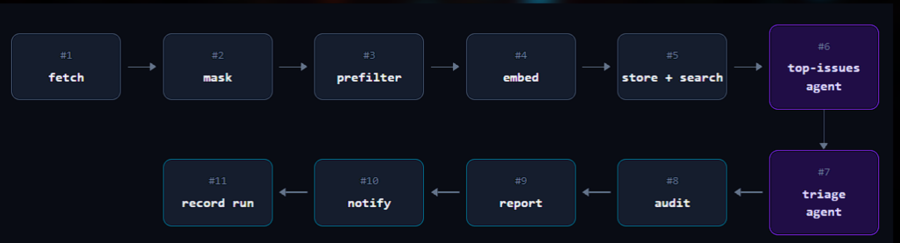
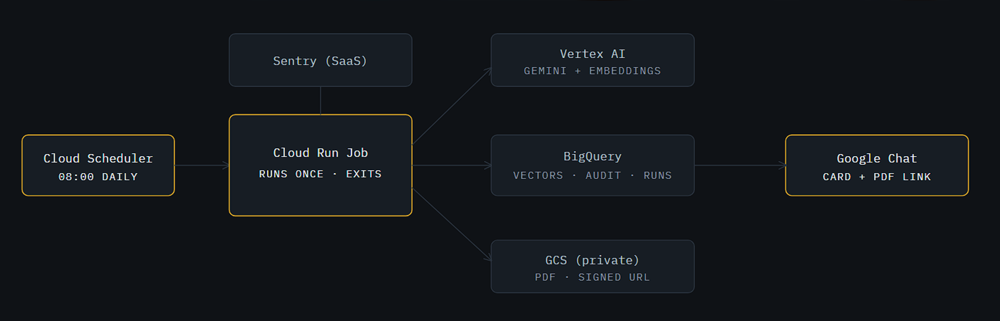
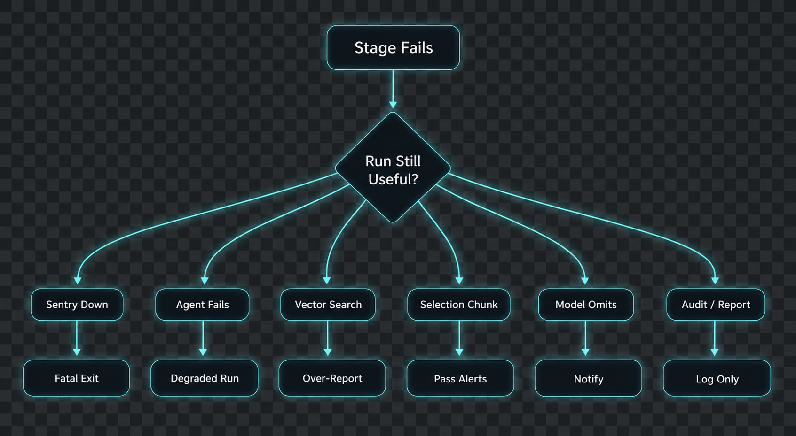

# Alert Triage Agent

Daily AI alert-triage pipeline running on Google Cloud Platform.

Every morning one **Cloud Run Job**, started by Cloud Scheduler, pulls the last
24h of unresolved Sentry issues with their stack traces, masks PII and secrets,
drops known noise, and embeds each alert into BigQuery. Two Gemini agents then
work on the result: a **top-issues agent** decides what is a repeat and ranks
the day's ten most important issues, and a **triage agent** assigns each one a
priority and explains why. The reasoning goes to BigQuery, the PDF report to a
private GCS bucket, and a card with a signed link to Google Chat.

## Results & Demo

The pipeline produces a comprehensive daily PDF report of the **top 10 issues** and alerts the team via Google Chat with a signed, time-limited URL to the bucket.

https://github.com/user-attachments/assets/affb4965-bd00-4acc-8ec4-d533f9923892

## Implementation

Eleven stages, from Sentry fetch to Chat card, masking and noise filtering
before anything reaches a model, then the two Gemini agents (top-issues, then
triage) with BigQuery vector search feeding both.



## Architecture

Cloud Scheduler triggers one Cloud Run Job; BigQuery holds the embeddings and
the audit trail, Secret Manager the Sentry and Chat credentials, and the PDF
lands in a private GCS bucket served through a signed URL.



## Quick start

```bash
python -m venv .venv && . .venv/bin/activate   # Windows: .venv\Scripts\activate
pip install -r requirements.txt
pytest

cp .env.local.example .env
python -m pipeline.main --run-date 2026-08-11
```

```bash
docker compose build triage         # production image FIRST
docker compose build test           # local image is built FROM it
docker compose run --rm triage      # one offline run -> ./artifacts
docker compose run --rm test        # the suite, against the local image
```

Build order matters: `Dockerfile.local` starts `FROM alert-triage:runtime`, so
a bare `docker compose build` tries to pull that image from Docker Hub and
fails.

The run writes the report to `artifacts/` and its state to `.local_state/`.
Re-running a date is a no-op (idempotency guard); `--force` replays it.

Before committing:

```bash
./scripts/check.sh                  # lint, types, tests, leak guard
```

## Deploying

Terraform, in two stacks: **bootstrap** (APIs, service accounts, project IAM,
Artifact Registry — once per project) and **environments/dev** (BigQuery, the
reports bucket, secrets, the job, the schedule). State lives in GitLab's HTTP
backend with locking. The image build and `terraform apply` are run manually.

```bash
cd infra/bootstrap
terraform init -backend-config=backend/dev.hcl
terraform apply -var-file=envs/dev.tfvars
```

## Pipeline Failure Modes

If the AI skips an alert, that alert doesn't disappear. It shows up in the
report marked *needs a human*. It's allowed to be wrong. It's not allowed to be
silently wrong.



## Repository layout

```
shared/     Pydantic schemas, config loader, logging
pipeline/   The job: sentry_client, masking, prefilter, embeddings, bq,
            agents/, pdf_report, chat_notify, storage, orchestrator, main
config/     priority_matrix.yaml (prose rules), noise_filters.yaml, masking_patterns.yaml
infra/      Terraform: bootstrap/, modules/, environments/dev/
deploy/     Dockerfile (production) and Dockerfile.local (production + pytest)
fixtures/   sample raw Sentry payloads for offline runs
eval/       label-free agent checks (invariants, groundedness, stability)
scripts/    triage_fixture.py, check.sh
tests/      unit tests — no GCP, no network
```
